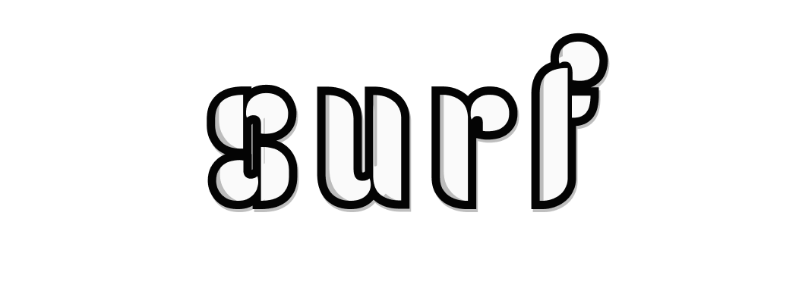

<p align="center">
    
</p>
<p align="center">
    <b>Surfing</b> the graphics pipeline.
</p>

## Setup
Not going to lie, setting this project up is dense. I've tried to abstract as much of it away as possible but some caveats and hiccups will remain.

The setup below uses a simple set of custom python scripts to run the build commands I've set out for each project. For project-specific compilation/execution steps not explicitly covered by those scripts, please refer to each sub-project's respective README.

### Setup (Windows)
1. Install the [Vulkan SDK](https://vulkan.lunarg.com/sdk/home#windows).

2. Ensure you have a valid shader compiler installed. The Vulkan SDK should come shipped with  a [glsl compiler](https://github.com/KhronosGroup/glslang) (`glslc`) if it was installed through the LunarG website. Alternatively, the [DirectX shader compiler](https://github.com/microsoft/DirectXShaderCompiler) (`dxc`) can be used to compile hlsl.

3. Install [OCaml](https://fdopen.github.io/opam-repository-mingw/installation/), for more information on the intricacies and caveats of this process, refer to the interpreter's [README](https://github.com/jake-pauls/surf/blob/main/surf/README.md).

4. Clone the repo and it's submodules recursively.
```
$ git clone --recursive git@github.com:jake-pauls/surf.git
```

5. In Cygwin, run the build scripts for the interpreter (requires OCaml/dune).
```
$ python ./scripts/surf.py surf
```   

6. In Cygwin, run the build scripts for the API (requires OCaml/dune/flexlink).
```
$ python ./scripts/surf.py api
```

**Note:** This will build the client library as a mingw static library. If the API is being used on mingw/unix this static library can be targeted. Alternatively, MSVC-based clients can use CMake by adding a subdirectory to target the API's `CMakeLists.txt` file (this is what the provided client uses).

7. Run the build scripts, this will generate the client CMake project.
```
$ python ./scripts/surf.py wave
```

8. Start the server.
```
$ ./api/build/server/surf.exe
```

9. Open the Visual Studio solution.
```
$ ./build/surf.sln
```

### Setup (Linux)
1. Install the [Vulkan SDK](https://vulkan.lunarg.com/sdk/home#windows). This may be shipped with your distro's package manager.
```
# Arch Linux
$ sudo pacman -S vulkan-devel
```

2. Ensure you have a valid shader compiler installed. Similar to Windows, either `glslc` or `dxc` can be used to compile glsl or hlsl respectively.
```
# Arch Linux
$ sudo pacman -S shaderc                 # glslc
$ sudo pacman -S directx-shader-compiler # dxc
```

3. Install OCaml, opam, and dune, which may be shipped with your distro's package manager. More setup information can be found on the [OCaml website](https://ocaml.org/docs/up-and-running).
```
# Arch Linux
$ sudo pacman -S opam
```

4. Clone the repo and it's submodules recursively.
```
$ git clone --recursive git@github.com:jake-pauls/surf.git
```

5. Run the build scripts. Unlike with Windows, all of them *may* be safe to run here.
```
# Interpreter
$ python ./scripts/surf.py surf

# API Server/Client Library
$ python ./scripts/surf.py api

# Client Demo/Project 
$ python ./scripts/surf.py wave
```

6. Make the client project.
```
$ make -C build
```

7. Start the server.
```
$ ./api/build/server/surf.exe
```

8. Run the client project. 
```
$ ./build/client/Wave/DEBUG/wave
```
